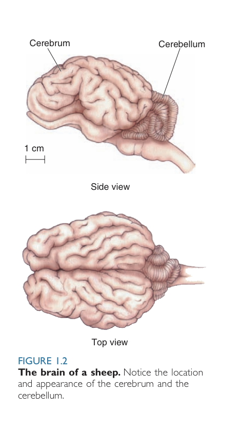

# 20200217012401 Neuroscience: Past, Present, and Future

Title: Neuroscience: Past, Present, and Future
Created: Feb 17, 2020 at 1:24 AM
Tags: ＃Neuroscience

- - - -
## The Origins of Neuroscience

### View of the Brain in Ancient Greece

- Hippocrates, known as the father of western medicine, argued that the brain houses intelligence
- Aristotle believed that heart gave rise to intelligence

### View of the Brain During the Roman Empire

- Galen, Greek Physician and writer,  suggested that `Cerebrum` and `Cerebellum` controlled two different parts of the body. According to him, the Cerebrum commands sensations, Cerebellum — muscles.

### Views of the Brain from the Renaissance to the Nineteenth Century

- Andreas Vesalius,  great anatomist, added more detail to the structure of the brain
- Rene Descartes, French Mathematician and Philosopher, argued that human brains are different from animals
- Modern Neuroscience supports that conclusion that the mind has a physical basis.

- The Brain is divided into—
	1. `White Matter`
	2. `Grey Matter`

The nervous system has—

	1. Central division
		1. `Brain`
		2. `Spinal Cord`
	2. Peripheral division
		1. `Network of Nerves`
 
The Brain has —

	1. Bumps: `Gyri`
	2. Grooves: `Sulci` and `Fissures`

These patterns divides the cerebrum into `Lobes`

[File Management](./Instructions/20200217011101_Instructions_for_File_Management.html)