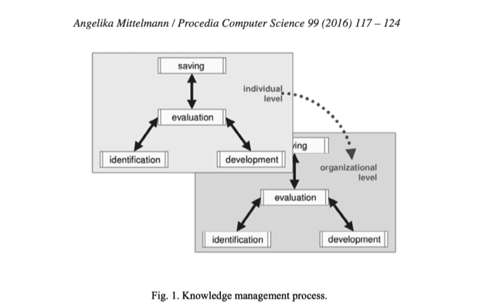
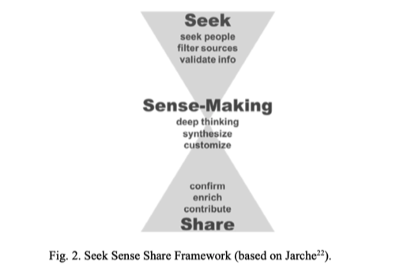

# 20200411020601 2016 Personal knowledge Management as basis for successful organisational knowledge management in digital age Mittelmann
***

Tags= #PKM, #Knowledge-Management #Organizational-Knowledge-Management #OKM #2016 #Mittelmann

### Abstract

Organizational Knowledge Management - OKM
Personal Knowledge Management - PKM

PKM Models
- Kolb’s Learning Circle
- Nonaka’s SECI Model and Concept of Ba
- Smedley’s PKM Octohedron
- Reinmann / Eppler’s Wissenswege
- Jarche’s “Seek Sense Share”
- Fitness Circuit for PKM

### Introduction

OKM and PKM are related and must be addressed to tackle -
- Digital Transformation within companies
- changed expectations of customers demanding to arrange their whole lives online
- Using big data for developing new business models in a shorted period of time for sustained business success
- the call for flexible working models and environments
- the lack of digital skills of many staff members

### Knowledge Management in the Digital Age

OKM aims to harvest Organization’s critical knowledge residing in the minds of the employees and disseminating it all over the organisation for creating new knowledge in order to achieve added value.

Probst’s Eight building blocks of OKM-
- Knowledge Goals
- Knowledge Identification
- Knowledge Acquisition
- Knowledge Development
- Knowledge Distribution
- Knowledge Use
- Knowledge Preservation
- Knowledge Measurement
These can be sustained in a continuous process cycle.

Knowledge management process has two levels-
1. The individual
2. The organisation 

Subprocesses for individual and organisation -
- Identification (identify missing information)
- Saving (documenting information)
- Development (developing new knowledge)
- Evaluation (Objectives are set and assessment of identified, saved or developed knowledge takes place)
At organisational level-
- Subprocesses are performed by groups, project teams, units or business areas
	- Identification (identify missing information in persons)
	- Saving (documenting information and lessons learned by groups and teams)
	- Development (developing new knowledge takes place through collaboration between persons)
	- Evaluation (Objectives are set and assessment of identified, saved or developed knowledge takes place accompanies the three sub-process above)

Peter Drucker’s “Knowledge Worker”
- applies ideas, concepts and information rather than manual skill
- are expected to solve non-standardised problems based on their knowledge, expertise using analytic tools which are abstract
- They take advantage of Web 2.0 for acquiring, categorising, classifying, storing, sharing knowledge within the communities of practice
- Successful because of flexibility, creativity and innovation
Recommended Skills by the author-
- Communication Skills with emphasis on social media communication skills
- ability to learn self-regulated to get the job done
- social intelligence (taking responsibility and build trust in informal social networks)
- ability to collaborate (face to face / virtual) with flexibility in taking tasks or solving problems necessary for success
- critical thinking skills to identify needs and appropriate solutions apart from the standard
- digital skills embedded within knowledge domain of the task in question
- knowledge management in the sense of how to find, evaluate, analyse, apply and share information within a particular context.

### Background to PKM
- Personal Knowledge is exclusively linked to individuals.
-  Effective PKM must support
	- retrieving 
	- structuring
	- storing
	- linking
	- formalising
of Knowledge artefacts 

Gorman and Pauleen’s PKM
- is an evolving set of understanding, skills and abilities
- allows individual to survive complex and changing organisational and social environments.

McFarlane’s PKM
- is a value management philosophy and approach
- adds value to performance, well-being and outcome through understanding and applying knowledge
- to achieve personal and non-personal goals

Wiig’s PKM
- to make citizens highly knowledgeable
- to function competently, effectively
- make commerce and industry competitive
- ensure personal and family decisions and actions will improve societal functions and quality for life

David A. Kolb’s view on PKM
- learning circle model
- learning is grounded in experience

Nonaka and Konno
- SECI-Model
- Concept of “Ba”

Smedley
- PKM Octohedron
- describes information flows between an expert and employees as well as between the community of practice
- emphasises unhindered information flows

Reinmann and Eppler’s PKM
- System-genetic understanding of knowledge
- Concept to mental basic principle
- Four-field scheme
- matrix of goals
Less complex paradigm is needed for understanding and everyday use at workplace. Jarche’s Seek Sense Share Framework meets these demands.

### Seek Sense Share Framework

Jarche’s Framework-
1. Seek: implies seeking out interesting people and filtering digital knowledge objects based on mechanical or human filters (aggregators)
2. Sense: implies making sense out of the found sources by placing information into the context of experience, describing patterns, trends, flows in large amount of information. It is a deep thinking process
3. Share: implies that the knowledge is confirmed and enriched by others as an act of mutual give and take.

- Social Learning has less value without PKM
- Fitness Circuit for PKM as a starting ground for PKM

### Overview of Fitness Circuit for PKM

- Takes the Seek Sense Share framework as a base
- Outlines how to put it in sustainable way

Recommends
- Warm-up
- Starting Exercise
- Circuit Training
- Sustained Exercise
- Partner Exercise

#### 1. Warm-up
- Checking physical fitness may include
	- balanced healthy diet
	- sufficient sleep
	- brain-compatible body exercise in case of low energy
	- relaxation for reducing stress
- Check mental fitness may include
	- singing
	- memory training
	- playing instrument

#### 2. Starting Exercise
1. Gather keywords for needed information and knowledge
2. Structure knowledge using a mind-map
3. Name folders using these key-words
4. Create rules for saving files with respect to knowledge objects
5. Tag knowledge objects with appropriate keywords
6. Use keyword for searching purposes
7. Evaluate the currency of knowledge objects and list keywords
8. Delete outdated knowledge objects on a regular base

#### 3. Sustained Exercises

Consists of -

A. Training of knowledge related behaviour
	1. Asking for help
	2. Saving lessons learned
	3. Selectively sharing learning with others
	4. Repeatedly asking what can be done better next time 

B. Learning knowledge related skills
	1. Being able to explicate implicit knowledge
	2. Active listening
	3. Sum up briefly and precisely complex issues
	4. Graphically prepare context clearly

C. Self-Regulated learning
	1. Creating personal competence portfolio
	2. Setting Knowledge goals
	3. Deducing future portfolio
	4. Defining and Implementing measures 	

#### 4. Circuit Training
- To be practiced in circular process
	- Seek: Starts with effective searching for knowledge objects based on defined keywords
	- Document and visualise findings
	- Create new knowledge based on Combined reading, documentation, creativity techniques, and social software tools.

Useful documentation techniques are-
1. Learning Diary,
2. Willke’s Micro Article
3. Yellow pages or digital Notebook
Useful visualising techniques are -
1. Mindmaps
2. Integration
3. Argumentation or concept maps

#### 5. Partner Exercise
- These activities are to be carried out with collaboration with others.
- Aimed to build sustainable personal network
	- Physical Method: going to relevant social gatherings
	- Virtual method: being active on social media

### Conclusion
- Hiring Digital Natives may help but not enough
- Responsibility of the learning process will be ultimately handed over to the employees
- What is required now is adapting the organisations to this new type of critical thinking, creative problem solving employees.	

## Reference

@article{mittelmann2016personal,
  title={Personal knowledge management as basis for successful organizational knowledge management in the digital age},
  author={Mittelmann, Angelika},
  journal={Procedia Computer Science},
  volume={99},
  pages={117--124},
  year={2016},
  publisher={Elsevier}
}